# PRACTICE CONFIG

## PART 1

### Task 1

#### Setting the application as follow
* Server port: 9081
* Context path: /likelion
* Logging pattern: Any of choices
* Logging level: TRACE

#### Answer


* Server port can be set by using: **server.port=9081**
* Context path: **server.servlet.context-path=/likelion**
* Logging patter: **logging.pattern.console=...**
* Logging level: **logging.level.root=TRACE (INFO by default)**

#### Result


### Task 2

#### Create 2 DTOs using validation annotation and testing the validation by creating 2 API call to them

**EmployeeDto**
* employeeId
* name: not empty, length from 10 to 50 chars
* birthDate
* gender
* email: not empty, using gmail format

**DepartmentDto**
* departmentId
* deptName: not empty, length from 10 to 50 chars
* description: not empty
* List<employeeDto>: validate each employeeDto in the list


#### Answer


```
There are 3 validate annotation to check for 
the presense of an input:

    1. @NotNull: Check if the input is null or not.
    If input is null, then throw an exception.
    
    2. @NotEmpty: Check if the input is empty or not
    (length of the input must be > 0 to be not empty
    and input is not null). Throw exception if the input
    is empty.
    
    3. @NotBlank: This will delete blank space at the 
    begining and at the end of the input, then check if
    the input is empty or not (length of the input must 
    be > 0 to be not empty and input is not null). Throw
    exception if the input is empty
```


* Use @Valid to check each employeeDto inside the list
* Use @Size(min=..., max=...) can set size for the input

#### Result

**NORMAL EMPLOYEE**

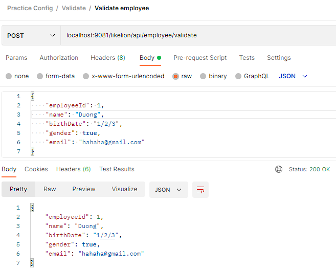

The validation not trim the beginning and the tail of the String
=> See space as a meaningful char

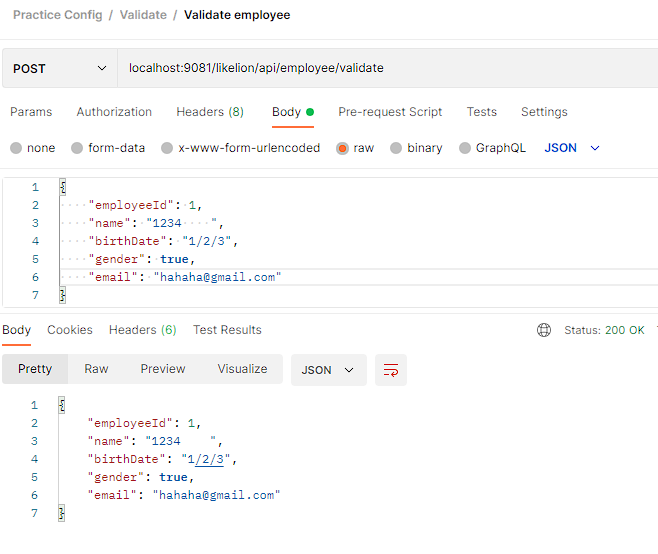

**NORMAL DEPARTMENT**

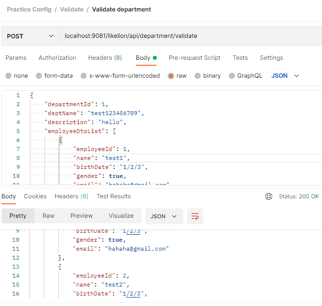

**NOT EMPTY CHECKING**

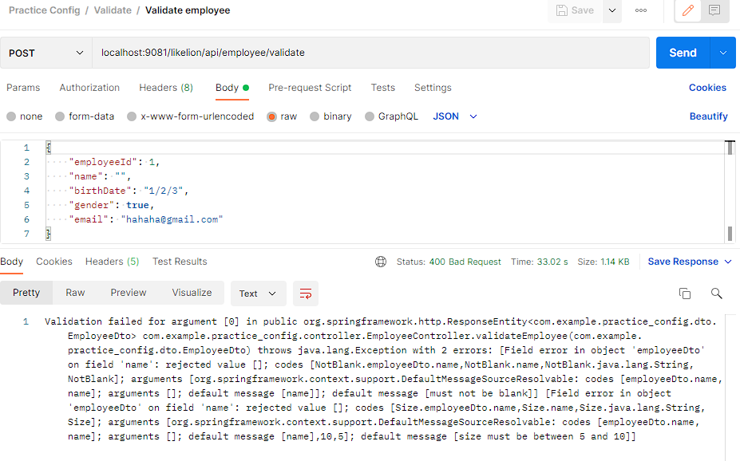

Just input blank will cause error

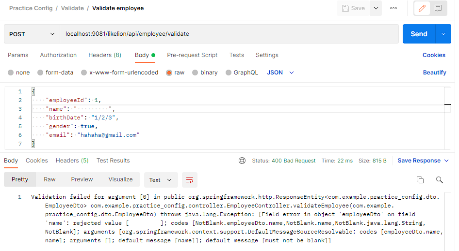

**SIZE CHECKING**

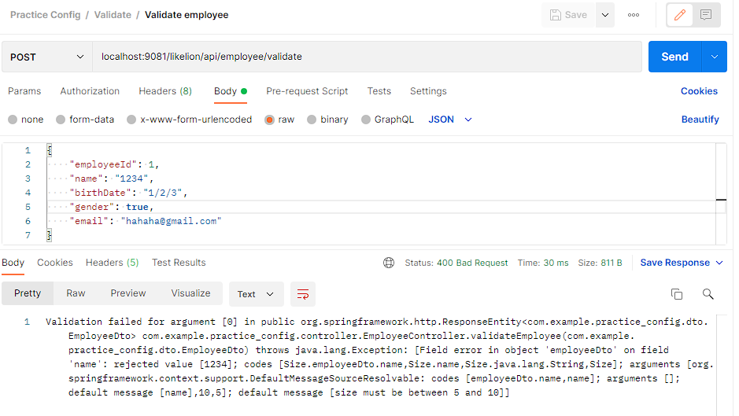

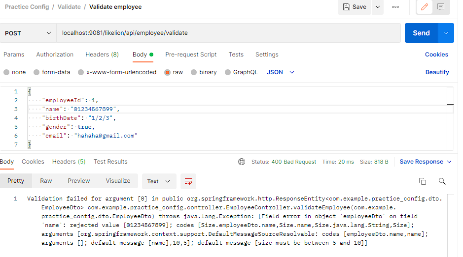

**VALIDATE IN LIST AND GMAIL FORMAT CHECKING**

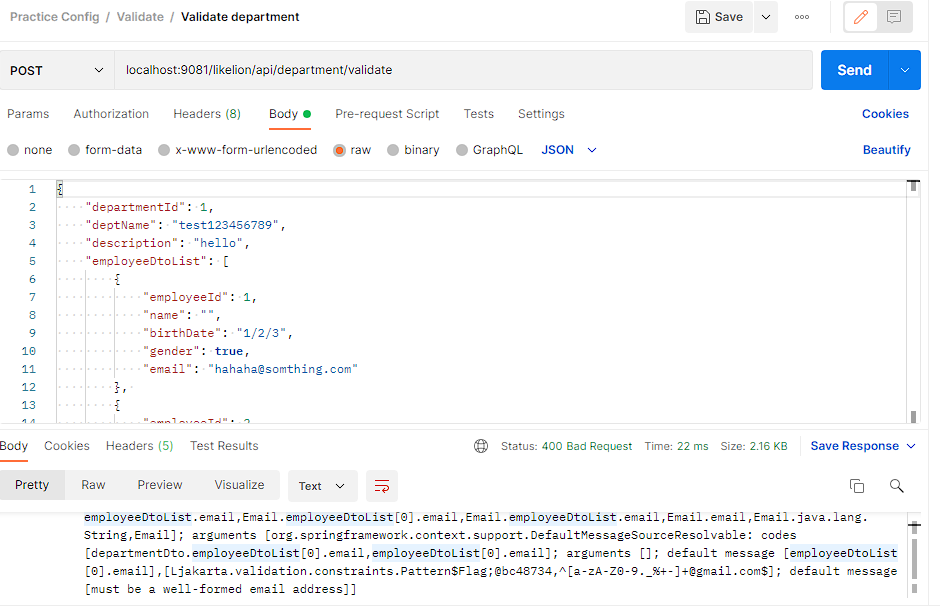


### Task 3

#### Create services for each DTO

* Each service needs to log out the input DTO and return the input DTO
* Apply Aspect Oriented Programming (AOP) to do the following tasks:
  * Logging before and after calling function in service of DepartmentDto
  * Logging after there is error in function in service of EmployeeDto

#### Answer

**CREATE SERVICE FOR DEPARTMENT DTO**

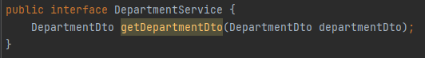

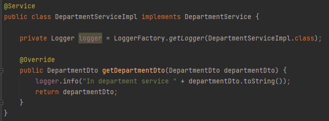

````
Using the logger as from the above picture to log out the dto
as requirement.
````

**CREATE CONTROLLER FOR DEPARTMENT DTO**

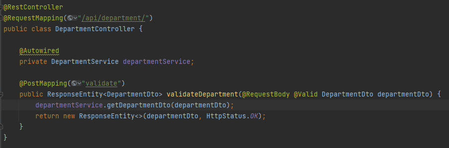

```
Using @Valid in Controller allow us to validate the
avaiability of the input if it match with the convention
we have setted in DTO
```

````
Do the same to create service and controller for employee dto
````

**APPLY AOP TO LOG WHEN CALLING FUNCTION**

````
WHAT IS AOP?

AOP is a programming paradigm that allows you to modularize 
cross-cutting concerns in your application, such as logging, 
security, and transaction management. 
AOP works by intercepting method calls and adding behavior 
before, after, or around the method execution. This can be 
useful for reducing boilerplate code and keeping your 
application more organized and maintainable.

Simply, the task that need to do thru out the project in the 
application will use AOP. Ex: Logging, etc.
````

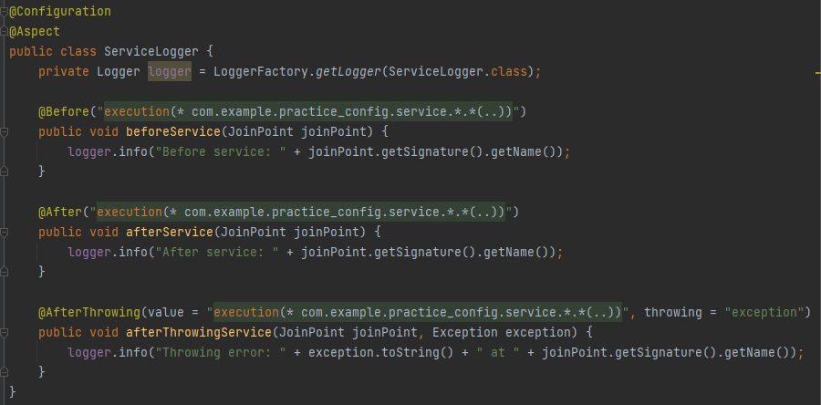

````
The class means whenever calling any functions ( .*(..) ) in 
any classes ( .* ) in package com.example....service, @Before
call the function will log down, @After call the function
will log down, and if the function has error @AfterThrowing
will log down (the " throwing = "exception" " must be the 
same name as " Exception exception " in the function)
````

````
For the @AfterThrowing to work, the controller must throw out
the exception. So, we fix the controller, and service of 
employee dto as following
````

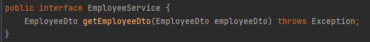

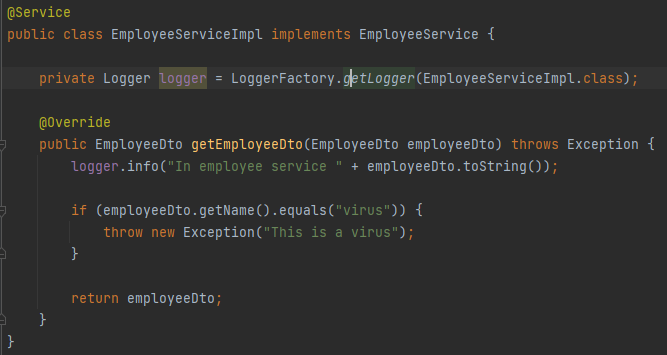

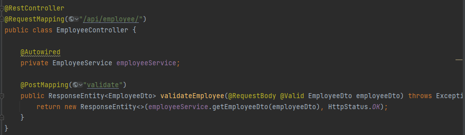


#### Result 


## PART 2

### TO BE UPDATED


