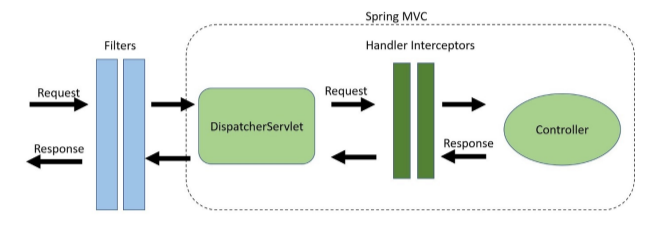

# PRACTICE CONFIG

## PART 1

### Task 1

#### Setting the application as follow
* Server port: 9081
* Context path: /likelion
* Logging pattern: Any of choices
* Logging level: TRACE

#### Answer


* Server port can be set by using: **server.port=9081**
* Context path: **server.servlet.context-path=/likelion**
* Logging patter: **logging.pattern.console=...**
* Logging level: **logging.level.root=TRACE (INFO by default)**

#### Result


### Task 2

#### Create 2 DTOs using validation annotation and testing the validation by creating 2 API call to them

**EmployeeDto**
* employeeId
* name: not empty, length from 10 to 50 chars
* birthDate
* gender
* email: not empty, using gmail format

**DepartmentDto**
* departmentId
* deptName: not empty, length from 10 to 50 chars
* description: not empty
* List<employeeDto>: validate each employeeDto in the list


#### Answer


```
There are 3 validate annotation to check for 
the presense of an input:

    1. @NotNull: Check if the input is null or not.
    If input is null, then throw an exception.
    
    2. @NotEmpty: Check if the input is empty or not
    (length of the input must be > 0 to be not empty
    and input is not null). Throw exception if the input
    is empty.
    
    3. @NotBlank: This will delete blank space at the 
    begining and at the end of the input, then check if
    the input is empty or not (length of the input must 
    be > 0 to be not empty and input is not null). Throw
    exception if the input is empty
```


* Use @Valid to check each employeeDto inside the list
* Use @Size(min=..., max=...) can set size for the input

#### Result

**NORMAL EMPLOYEE**


The validation not trim the beginning and the tail of the String
=> See space as a meaningful char


**NORMAL DEPARTMENT**


**NOT EMPTY CHECKING**


Just input blank will cause error


**SIZE CHECKING**


**VALIDATE IN LIST AND GMAIL FORMAT CHECKING**


### Task 3

#### Create services for each DTO

* Each service needs to log out the input DTO and return the input DTO
* Apply Aspect Oriented Programming (AOP) to do the following tasks:
  * Logging before and after calling function in service of DepartmentDto
  * Logging after there is error in function in service of EmployeeDto

#### Answer

**CREATE SERVICE FOR DEPARTMENT DTO**


````
Using the logger as from the above picture to log out the dto
as requirement.
````

**CREATE CONTROLLER FOR DEPARTMENT DTO**


```
Using @Valid in Controller allow us to validate the
avaiability of the input if it match with the convention
we have setted in DTO
```

````
Do the same to create service and controller for employee dto
````

**APPLY AOP TO LOG WHEN CALLING FUNCTION**

````
WHAT IS AOP?

AOP is a programming paradigm that allows you to modularize 
cross-cutting concerns in your application, such as logging, 
security, and transaction management. 
AOP works by intercepting method calls and adding behavior 
before, after, or around the method execution. This can be 
useful for reducing boilerplate code and keeping your 
application more organized and maintainable.

Simply, the task that need to do thru out the project in the 
application will use AOP. Ex: Logging, etc.
````


````
The class means whenever calling any functions ( .*(..) ) in 
any classes ( .* ) in package com.example....service, @Before
call the function will log down, @After call the function
will log down, and if the function has error @AfterThrowing
will log down (the " throwing = "exception" " must be the 
same name as " Exception exception " in the function)
````

````
For the @AfterThrowing to work, the controller must throw out
the exception. So, we fix the controller, and service of 
employee dto as following
````


#### Result 


## PART 2

### Task 1

#### Using interceptor for logging

* Log in each function preHandle, postHandle, afterComplete
* Using interceptor to determine the processing time of each request as following instructions
  * At preHandle, set 1 attribute with value is current time at that moment 
  * At postHandle, get current time at the moment and minus the time attribute have been set in preHandle

#### Answer

````
WHAT IS INTERCEPTOR?


Interceptors are a higher-level mechanism that is specific 
to the Spring MVC framework.

Interceptors are used to intercept HTTP requests and 
perform additional operations before or after the request is 
processed by the application.
````


````
According to the instructions, in preHandle, set attribute
start time by using: 
  " request.setAttribute("startTime", System.currentTimeMillis()) "

And in postHandle, get the attribute by using:
  " request.getAtribute("startTime") "
````


````
After making the interceptor, we need to add it to the project.
The above code is to add the interceptor to the project.
````

#### Result


````
The interceptor running before going to the controller and
after receive the data from the controller.

This is expected the same as in theory.
````




### Task 2

#### Using filter to detect Postman

* If the request is from other browser than Postman, then the request can go to controller
* If the request is from Postman, do the following:
  * Set response status to 403
  * Set the response body to have a message "You're requesting from Postman!"


#### Answer

**BROWSER DETECTOR**


````
In the IF block

I need the request to stop before calling the controller 
So I dont call filterChain.doFilter()
````

````
In the ELSE block

The request can normally go to the controller by calling
filterChain.doFilter()

I personally want to modify the response body right after
receive data from the controller.
But we cannot getWrite() more than 1 time for 1 response,
we have written in the response once with the controller.
One way to modify the response body is using response wrapper.

And please modify the response after calling 
filterChain.doFilter(request, responseWrapper), or else the 
controller cannot write to the response => causing error
````

````
To detect the browser in doFilter()

  1. Cast the servletRequest to httpServletRequest
      HttpServletRequest httpServletRequest = 
      (HttpServletRequest) servletRequest
      
  2. Get User-Agent in header of the request
      String browser = 
      httpServletRequest.getHeader("User-Agent")
      
  3. The browser is the name of the browser with its version
      To check the browser name
      browser.contains("Postman")
````

````
To add a custom header to the response

  1. Cast the servletResponse to httpServletResponse
      HttpServletResponse httpServletResponse = 
      (HttpServletResponse) servletResponse
      
  2. Add the header to the response:
      httpServletResponse
        .addHeader("Custom-Header", "This is a custom header")
````

````
To add the response body
   
   1. Cast the servletResponse to httpServletResponse
      HttpServletResponse httpServletResponse = 
      (HttpServletResponse) servletResponse
      
   2. Set content type of the body
      httpServletResponse.setContentType("application/json")
      
   3. Prepare the body
      String responseBody = 
        "{ \"message\": \"You're requesting from Postman!\" }"
        
   4. Write to the body
      httpServletResponse.getWriter().write(responseBody)
      
   5. Close the writer
      httpServletResponse.getWriter().flush()
   
ATTENTION: 1 request can open to write repsonse once


To modify the status of the repsonse
httpServletResponse
  .setStatus(HttpServletResponse.SC_FORBIDDEN);
````

**FILTER REGISTRATION**


**REST CONTROLLER ADVICE**


````
Whenever there is error of type Exception in rest controller
this Rest Controller Advice will catch the error and return
the repsonse entity with BAD_REQUEST as in the code
````

#### Result


### Differentiate FILTER and INTERCEPTOR

* Filters and interceptors are used to intercept HTTP requests and perform additional operations before or after the request is processed by the application
  * Filter:
    * Filters are applied to all requests that pass through the container, regardless of whether they are handled by Spring MVC or not
    * Filters are part of the Servlet API =>  can be used with any web framework that supports the Servlet API
    * Filters are used to perform generic pre- and post-processing of HTTP requests and responses, such as authentication, logging, or caching
    * Filters are typically used to modify the request or response object, or to invoke a downstream service before or after the request is processed by the application
  * Interceptor:
    * Interceptors are applied only to requests that are handled by Spring MVC
    * Interceptors are part of the Spring MVC framework => only available when using Spring MVC
    * Interceptors are used to intercept and modify the behavior of Spring MVC controllers
    * Interceptors are typically used to add additional data to the request or model, or to handle errors that occur during request processing
* Filters are more suitable for low-level request processing tasks such as encoding and decoding, caching, and compression => common pre-processing and post-processing tasks that are applied to all requests and responses
* Interceptors are better suited for application-specific tasks such as modifying the response body, handling exceptions, and applying cross-cutting concerns such as security and auditing => more fine-grained control over the request handling process and to add additional functionality to your application


