# TUTORIAL DEMO

---

* [Create tutorial](#create-tutorial)
* [Get all tutorials](#get-all-tutorials)
* [Get tutorial by id](#get-tutorial-by-id)
* [Update tutorial by id](#update-tutorial)
* [Delete tutorial by id](#delete-tutorial-by-id)
* [Delete all tutorials](#delete-all-tutorials)
* [Get tutorial by published](#get-tutorials-by-published)
* [Get all tutorial by title matching](#get-tutorials-by-title)

***

## Initial database

**Database config**

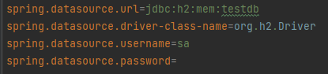

***

## Create tutorial

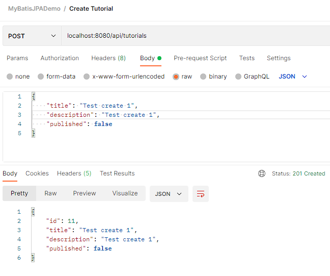

**New value in database**

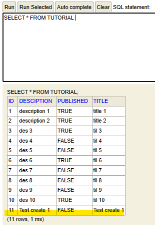

***

## Get all tutorials

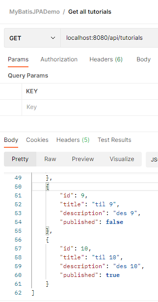

***

## Get tutorial by id

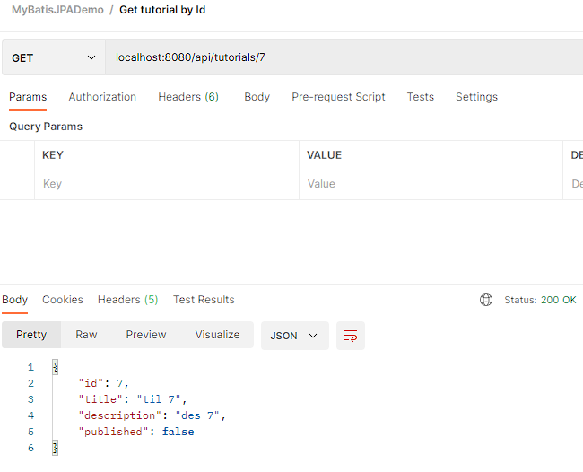

***

## Update tutorial

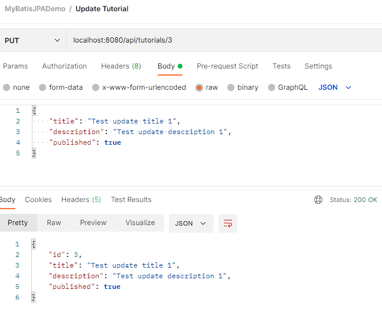

**Row 3 is updated**

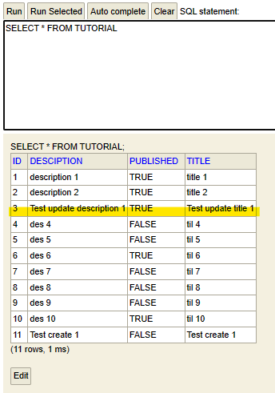

***

## Delete tutorial by id

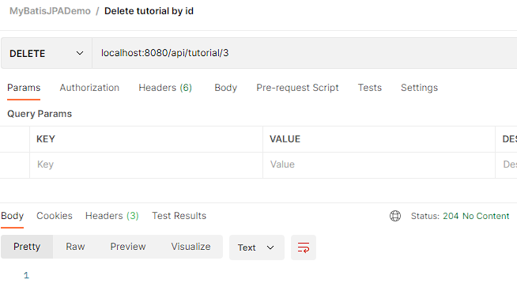

**Tutorial with id 3 is deleted**

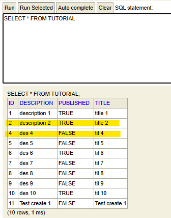

***

## Delete all tutorials

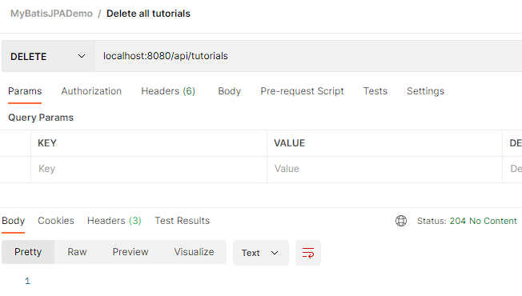

**All tutorials were deleted**

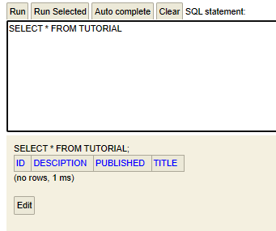

***

## Get tutorials by published

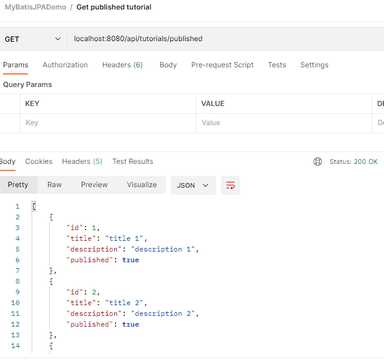

***

## Get tutorial(s) by title

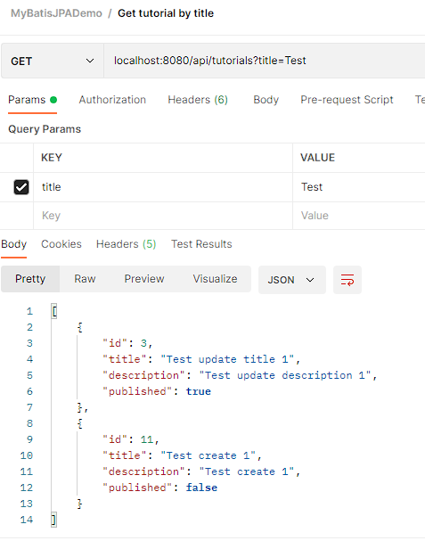
