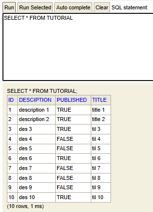

# TUTORIAL DEMO

---

* [Create tutorial](#create-tutorial)
* [Get all tutorials](#get-all-tutorials)
* [Get tutorial by id](#get-tutorial-by-id)
* [Update tutorial by id](#update-tutorial)
* [Delete tutorial by id](#delete-tutorial-by-id)
* [Delete all tutorials](#delete-all-tutorials)
* [Get tutorial by published](#get-tutorials-by-published)
* [Get all tutorial by title matching](#get-tutorials-by-title)

***

## Initial database

**Database config**

***

## Create tutorial

**New value in database**

***

## Get all tutorials

***

## Get tutorial by id

***

## Update tutorial

**Row 3 is updated**

***

## Delete tutorial by id

**Tutorial with id 3 is deleted**

***

## Delete all tutorials

**All tutorials were deleted**

***

## Get tutorials by published

***

## Get tutorial(s) by title

