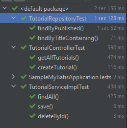
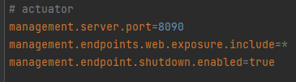
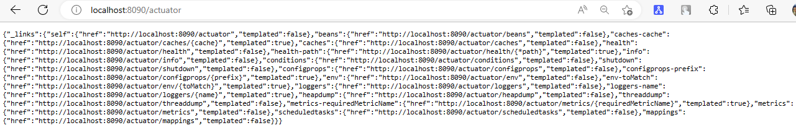
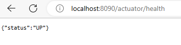
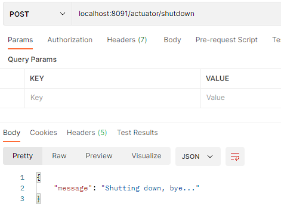
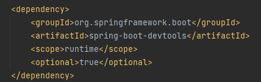
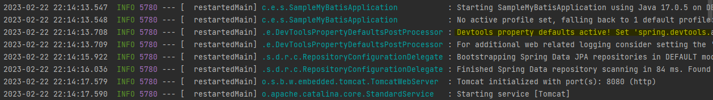
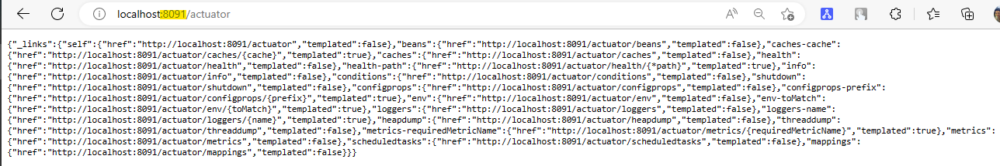
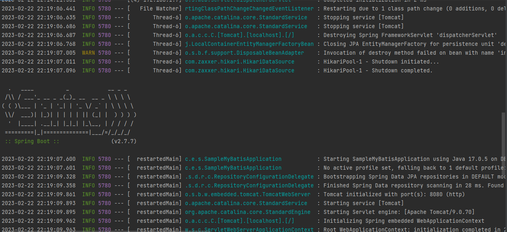

# Testing, Actuator and devtools

## Part 1: Testing

## Part 2: Actuator and devtools

### Actuator

* Management port: 8090
* Open all endpoints, including shutdown endpoint
* Doing following requirements:
  * Use specific actuator url to watch all endpoints
  * Use specific actuator url to watch the app's health status
  * Use specific actuator url to shut down the app

#### Answer

#### Result

### DevTools

* During runtime, change management port of actuator to 8091
  * Use specific actuator url with new management port to watch all endpoints

#### Answer

#### Result

Just add devtools dependency, and it will do the thing

